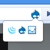
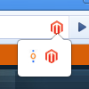
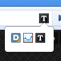
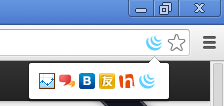

ChromeSnifferPlus
=================

### Introduction

This extension is an extended version of the Appspector(ChromeSniffer).

Sniff web framework and javascript libraries run on browsing website.

With this extension, You can sniff:

- javascript Library: jQuery, ExtJS, Angular ...
- Web APIs: Blogger, Google Analytics ...
- Web Framework: WordPress, phpBB, Drupal, MediaWiki, codeigniter ...
- Web Server: PHP, Apache, nginx, IIS ...

When you surf the internet with ChromeSnifferPlus, You can also find more unknown frameworks and libraries.

If you are a developer, you can [Create Issues](https://github.com/justjavac/ChromeSnifferPlus/issues).

view [change log](./changelog.md)

[中文介绍](./README_zh_CN.md)

### Install

- [Chrome Web Store](https://chrome.google.com/webstore/detail/chrome-sniffer-plus/fhhdlnnepfjhlhilgmeepgkhjmhhhjkh)

### Screenshot

 &nbsp;&nbsp;&nbsp;&nbsp;
 &nbsp;&nbsp;&nbsp;&nbsp;
 &nbsp;&nbsp;&nbsp;&nbsp;

### Credits

- [justjavac](https://github.com/justjavac)

### License

ChromeSnifferPlus is released under the GPL License. See the bundled [LICENSE](./LICENSE) file for details.
